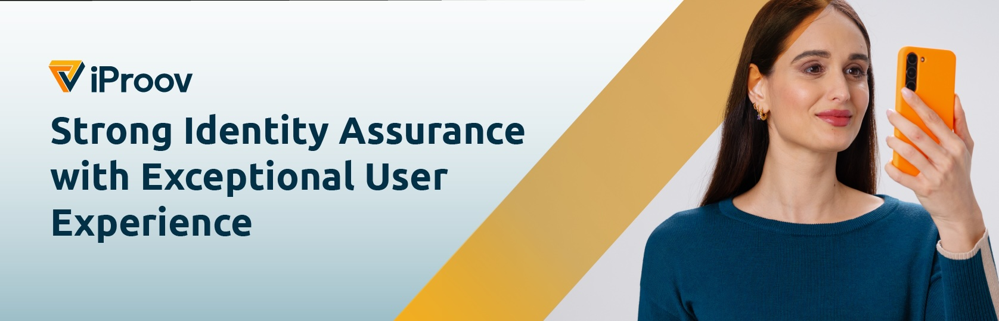

# iProov Biometrics Android SDK v6.2.1

## Table of contents

- [Introduction](#introduction)
- [Contents](#contents)
- [Upgrading from earlier versions](#upgrading-from-earlier-versions)
- [Registration](#registration)
- [Installation](#installation)
- [Get started](#get-started)
- [Options](#options)
- [String localization & customization](#string-localization--customization)
- [Handling failures & errors](#handling-failures--errors)
- [ML Kit support](#ml-kit-support)
- [Sample code](#sample-code)
- [Help & support](#help--support)

## Introduction

The iProov Biometrics Android SDK enables you to integrate iProov into your Android app. We also have an [iOS Biometrics SDK](https://github.com/iproov/ios), [Xamarin bindings](https://github.com/iproov/xamarin) and [Web Biometrics SDK](https://github.com/iProov/web).

It supports both _Genuine Presence Assurance_ and _Liveness Assurance_ methods of face verification. Which method gets used depends on the token request and response. See [Get started](#-get-started).

### Requirements

- Android Studio
- API Level 19 (4.4 KitKat) and above
- Compilation target, build tools and Android compatibility libraries must be 29+
- AndroidX

Within this repository you can find the fictitious "Waterloo Bank" sample Android app, which illustrates an example iProov integration.

## Contents

The framework package is provided via this repository, which contains the following:

* **README.md** - This document
* **maven** - Maven repository for the Biometrics SDK
* **waterloo-bank** - A sample project of iProov for the fictitious _Waterloo Bank_.
* **resources** - Directory containing additional development resources you may find helpful.


## Upgrading from earlier versions

If you're already using an older version of the iProov SDK, consult the [Upgrade Guide](https://github.com/iProov/android/wiki/Upgrade-Guide) for detailed information about how to upgrade your app.

## Registration

You can obtain API credentials by registering on the [iProov Portal](https://portal.iproov.com/).

## Installation

The iProov Biometrics Android SDK is provided in AAR format (Android Library Project) as a Maven dependency.

1. Open the build.gradle file corresponding to your new or existing Android Studio project with which you wish to integrate (commonly, this is the build.gradle file for the `app` module).

2. Add the repositories section to your build.gradle file:

    ```groovy
    repositories {
        maven { url 'https://raw.githubusercontent.com/iProov/android/master/maven/' }
    }
    ```

3. Add the iProov SDK to the dependencies section in your app's build.gradle file:

    ```groovy
    dependencies {
        implementation('com.iproov.sdk:iproov:6.2.1')
    }
    ```

4. Add support for Java 8 to your app build.gradle file (you can skip this step if you already have Java 8 enabled):

    ```groovy
    android {
        compileOptions {
            sourceCompatibility JavaVersion.VERSION_1_8
            targetCompatibility JavaVersion.VERSION_1_8
        }
    }
    ```

If you wish to make use of pose control functionality, you will also need to [add the ML Kit module to your app](#-ml-kit-support).

You may now build your project!

## Get started

To use iProov to enrol or verify a user it is necessary to follow these steps:

### Obtain a token

Before being able to launch iProov, you need to get a token to iProov against. There are 2 different token types:

1. A **verify** token - for logging-in an existing user
2. An **enrol** token - for registering a new user

In a production app, you normally would want to obtain the token via a server-to-server back-end call.
For the purposes of on-device demos/testing, we provide Kotlin/Java sample code for obtaining tokens via [iProov API v2](https://eu.rp.secure.iproov.me/docs.html) with our open-source [Android API Client](https://github.com/iProov/android-api-client).

### Register a listener

In order to monitor the progress of an iProov scan and receive the result, you should register an `IProov.Listener` class with a call to `IProov.registerListener()`. Once the listener is no longer required, you should unregister it with a call to `IProov.unregisterListener()`.

Please note the following:

* Multiple listeners can be registered simultaneously.
* If you wish to replay the last event upon registering your listener, you can call `IProov.registerListener(listener, true)`.
* Any listener can only be registered once, registering the same listener more than once will have no effect.
* Listeners are held as `WeakReference`s to avoid memory leaks, however it is still best practice to explicitly unregister a listener when you are finished with it.
* We advise registering the listener in `onCreate()` and unregistering it in `onDestroy()`.


##### Kotlin

```kotlin
class MainActivity : AppCompatActivity(), IProov.Listener {

    // IProov.Listener interface ----

    override fun onConnecting() {
        // Called when the SDK is connecting to the server. You should provide an indeterminate
        // progress indication to let the user know that the connection is being established.
    }

    override fun onConnected() {
        // The SDK has connected, and the iProov user interface will now be displayed. You
        // should hide any progress indication at this point.
    }

    override fun onProcessing(progress: Double, message: String) {
        // The SDK will update your app with the progress of streaming to the server and authenticating
        // the user. This will be called multiple time as the progress updates.
    }

    override fun onSuccess(result: IProov.SuccessResult) {
        // The user was successfully verified/enrolled and the token has been validated.
        token: String = result.token
    }

    override fun onFailure(result: IProov.FailureResult) {
        // The user was not successfully verified/enrolled, as their identity could not be verified,
        // or there was another issue with their verification/enrollment.
        token: String = result.token
        reason: String = result.reason
        feedbackCode: String = result.feedbackCode
    }

    override fun onCancelled() {
        // The user cancelled iProov, either by pressing the close button at the top right, or pressing
        // the home button.
    }

    override fun onError(e: IProovException) {
        // The user was not successfully verified/enrolled due to an error (e.g. lost internet connection)
        // You can obtain the reason from the reason property.
        // It will be called once, or never.
    }

    // Overrides ----

    override fun onCreate(savedInstanceState: Bundle?) {
        super.onCreate(savedInstanceState)
        IProov.registerListener(this)
    }

    override fun onDestroy() {
        IProov.unregisterListener(this)
        super.onDestroy()
    }
}

```

##### Java

```java
public class MainActivity extends AppCompatActivity implements IProov.Listener {

    // IProov.Listener interface ----

    @Override
       public void onConnecting() {
        // Called when the SDK is connecting to the server. You should provide an indeterminate
        // progress indication to let the user know that the connection is being established.
    }

    @Override
    public void onConnected() {
        // The SDK has connected, and the iProov user interface will now be displayed. You
        // should hide any progress indication at this point.
    }

    @Override
    public void onProcessing(double progress, String message) {
        // The SDK will update your app with the progress of streaming to the server and authenticating
        // the user. This will be called multiple time as the progress updates.
    }

    @Override
    public void onSuccess(IProov.SuccessResult result) {
        // The user was successfully verified/enrolled and the token has been validated.
        String token = result.token;
    }

    @Override
    public void onFailure(IProov.FailureResult result) {
        // The user was not successfully verified/enrolled, as their identity could not be verified,
        // or there was another issue with their verification/enrollment.
        String token = result.token;
        String reason = result.reason;
        String feedbackCode = result.feedbackCode;
    }

    @Override
    public void onCancelled() {
        // The user cancelled iProov, either by pressing the close button at the top right, or pressing
        // the home button.
    }

    @Override
    public void onError(IProovException e) {
        // The user was not successfully verified/enrolled due to an error (e.g. lost internet connection)
        // You can obtain the reason by calling getReason().
        // It will be called once, or never.
    }

    // Overrides ----

    @Override
    protected void onCreate(@Nullable Bundle savedInstanceState) {
        super.onCreate(savedInstanceState);
        IProov.registerListener(this);
    }

    @Override
    protected void onDestroy() {
        IProov.unregisterListener(this);
        super.onDestroy();
    }
}
```

### Launch

Once you have obtained the a Genuine Presence Assurance or Liveness Assurance token, you can simply call `IProov.launch()`.

You can customize the SDK by adjusting visual appearance and setting various user experience options by passing in an `IProov.Options` object (described fully [later](#-options) in this document).

##### Kotlin

```kotlin
class MainActivity : AppCompatActivity() {

    private fun launchIProov() {
        val options = IProov.Options()
        // ...customise any iProov options...

        try {
            IProov.launch(
                this, // Reference to current activity
                "https://eu.rp.secure.iproov.me", // Streaming URL
                "{{ your token here }}", // iProov token
                options // Optional
            )
        } catch (ex: IProovException) {
            // Handle immediate failures: MultiWindowUnsupportedException, ListenerNotRegisteredException or CaptureAlreadyActiveException
        }
    }
}

```

##### Java

```java
public class MainActivity extends AppCompatActivity {

    private void launchIProov() {
        IProov.Options options = new IProov.Options();
        // ...customise any iProov options...

        try {
            IProov.launch(
                this, // Reference to current activity
                "https://eu.rp.secure.iproov.me", // Streaming URL
                "{{ your token here }}", // iProov token
                options // Optional
            );
        } catch (IProovException e) {
            // Handle immediate failures: MultiWindowUnsupportedException, ListenerNotRegisteredException or CaptureAlreadyActiveException
        }
    }
}
```

### Important notes

> **⚠️ SECURITY NOTICE:** You should never use iProov as a local authentication method. You cannot rely on the fact that the success result was returned to prove that the user was authenticated or enrolled successfully (it is possible the iProov process could be manipulated locally by a malicious user). You can treat the success callback as a hint to your app to update the UI, etc. but you must always independently validate the token server-side (using the validate API call) before performing any authenticated user actions.

> **⚠️ IMPLEMENTATION WARNING:** [Google](https://developer.android.com/guide/topics/manifest/activity-element#lmode) states that `singleInstance` and `singleTask` are `not recommended for general use`. We specifically don't recommend the calling Activity to have a `launchMode` of `singleInstance` - when tested, `back` does not always work correctly, particularly after the task switcher has momentarily put any `standard` Activity (like IProov) into the background.

## Options

You can customize the iProov session by passing in an instance of `IProov.Option` to the `IProov.launch()` method. For further information see [FAQ](https://github.com/iProov/android/wiki/Frequently-Asked-Questions). A list of available parameters for customization is below:

##### Kotlin

```kotlin
val options = IProov.Options()

/*
    options.ui
    Configure options relating to the user interface
*/

options.ui.autoStartDisabled = true // With autostart, instead of requiring a user tap, there is an auto-countdown a face is detected. Default false.
options.ui.title = "Authenticating to ACME Bank" // The message shown during canny preview. Default null.

// Adjust various colors for the camera preview:
options.ui.backgroundColor = Color.BLACK
options.ui.lineColor = Color.CYAN
options.ui.loadingTintColor = Color.RED // Please note this is option is deprecated, and only takes effect when used in conjunction with the useLegacyConnectingUI option.
options.ui.notReadyTintColor = Color.BLUE
options.ui.readyTintColor = Color.GREEN
options.ui.livenessTintColor = Color.BLUE

options.ui.enableScreenshots = true // For added security, screenshotting is disabled during IProoving; re-enable this here. Default: false.
options.ui.fontAsset = "SomeFont.ttf" // Set the default font from assets directory.
options.ui.fontResource = R.font.some_font // Set the default font from font resources.
options.ui.logoImageResource = R.drawable.logo // Logo to be included in the title (takes precedence over logoImageDrawable). Defaults to iProov logo.
options.ui.logoImageDrawable = drawable // Logo to be included in the title. Defaults to iProov logo.
options.ui.scanLineDisabled = true // Disable the scan-line whilst scanning the face. Default: false.
options.ui.filter = filter // Adjust the filter used for the face preview this can be CLASSIC (as in pre-v5), SHADED or VIBRANT. Default: SHADED.
options.ui.orientation = orientation // Set the orientation of the iProov activity: enum Orientation (PORTRAIT, REVERSE_PORTRAIT, LANDSCAPE, REVERSE_LANDSCAPE). Note that this rotates the UI and does not rotate the camera; this is because it is intended to support USB cameras on a LANDSCAPE display, where the camera is oriented normally.
options.ui.useLegacyConnectingUI = false // When enabled, the iProov SDK will provide a UI for establishing the connection, rather than your app. Please note that this option is now deprecated and will be removed in a future version of the SDK. You should now use the onConnecting() and onConnected() callback methods to provide your own UI for connection progress.
options.ui.activityCompatibilityRequestCode = requestCode // If set, enables Activity compatibility mode with the specified requestCode. See the FAQ for details.


/*
    options.network
    Configure options relating to networking & security
*/

options.network.disableCertificatePinning = false // When true (not recommended), disables certificate pinning to the server. Default false
options.network.certificates = arrayOf(R.raw.iproov__certificate) // Optionally supply an list of resourceIDs of certificates files to be used for pinning. Useful when using your own baseURL or for overriding the built-in certificate pinning for some other reason. Certificates should be generated in DER-encoded X.509 certificate format, eg. with the command $ openssl x509 -in cert.crt -outform der -out cert.der
options.network.timeoutSecs = duration // The streaming timeout in seconds - setting to 0 disables timeout (default 10)
options.network.path = path // The path to use when streaming, defaults to "/socket.io/v2/". You should not need to change this unless directed to do so by iProov.

/*
    options.capture
    Configure options relating to the capture functionality
*/

options.capture.camera = Camera.EXTERNAL // FRONT or EXTERNAL (USB). Default is FRONT.
options.capture.faceDetector = IProov.FaceDetector.AUTO // Explicitly declare which face detector is used, can either be AUTO, ML_KIT or CLASSIC. The AUTO declaration will try to use the ML Kit face detector and fallback to classic if unavailable. Default: AUTO.

// You can specify max yaw/roll/pitch deviation of the user's face to ensure a given pose. Values are provided in normalised units.
// These options should not be set for general use. Please contact iProov for further information if you would like to use this feature.
options.capture.maxPitch = 0.25
options.capture.maxYaw = 0.25
options.capture.maxRoll = 0.25
```

## String localization & customization

The iProov Biometrics Android SDK only ships with English language strings. You are free to localise/customise these strings in your app, if you choose to do so.

All iProov strings are prefixed with `iproov__` and can be overriden by your app's strings.xml file. A copy of the iProov strings.xml file can be found [here](https://github.com/iProov/android/blob/master/resources/strings.xml).

Strings for failure reasons are handled in a special way, in the form `R.string.iproov__failure_<feedback code>` e.g. `iproov__failure_ambiguous_outcome` exist and will be used for `reason`, allowing it to provide localised translations for all current and future failure codes.

## Handling failures & errors

### Failures

Failures occur when the user's identity could not be verified for some reason. A failure means that the capture was successfully received and processed by the server, which returned a result. This results in a call to the `onFailure()` listener method.

> ⚠️ **NOTE:** It's important to understand the difference between _failures_ and _errors_. In a failure case, iProov was able to successfully process the claim, but was unable to verify the user's identity due to one of a number of reasons. In the error case, the claim failed entirely and iProov was unable to process the claim.

| `feedbackCode` | `reason` |
|-----------------------------------|---------------------------------------------------------------|
| `ambiguous_outcome` | Sorry, ambiguous outcome |
| `motion_too_much_movement` | Please do not move while iProoving |
| `lighting_flash_reflection_too_low` | Ambient light too strong or screen brightness too low |
| `lighting_backlit` | Strong light source detected behind you |
| `lighting_too_dark` | Your environment appears too dark |
| `lighting_face_too_bright` | Too much light detected on your face |
| `motion_too_much_mouth_movement` | Please do not talk while iProoving |

The list of feedback codes and reasons is subject to change.

### Errors

In cases where the iProov `launch()` method fails immediately, it will throw one of the following `IProovException` subclasses:-

- `ListenerNotRegisteredException` - The `launch()` method was called before a listener was registered using `registerListener()`.
- `MultiWindowUnsupportedException` - The user attempted to iProov in split-screen/multi-screen mode, which is not supported.
- `CaptureAlreadyActiveException` - An existing iProov capture is already in progress. Wait until the current capture completes before starting a new one.


In cases where the iProov process failed entirely (i.e. iProov was unable to verify or enrol the user due to a system failure of some kind), the `onError()` listener method will be called with a subclass of `IProovException`. These exceptions are as follows:-

- `CameraException` - An error occurred acquiring or using the camera. This could happen when a non-phone is used with/without an external/USB camera. See Options.capture.setCameraLensFacing().
- `CameraPermissionException` - The user disallowed access to the camera when prompted. You should prompt them to re-enable camera permissions via Settings.
- `EncoderException` - An error occurred with the video encoding process. This should never occur.
- `FaceDetectorException` - An error occurred with the face detector.
- `LightingModelException` - An error occurred with the lighting model. This should never occur.
- `ServerException` - The token was invalidated server-side, or some other unrecoverable server error occurred.
- `NetworkException` - An error occurred with communications to the server. This generally indicates a device connectivity issue (e.g. the user's session has timed out, or internet service has been lost).
- `UnsupportedDeviceException` - The device is not supported, (e.g. does not have a front-facing camera).

## Alternative face detectors

By default, the iProov Biometrics Android SDK leverages the [Android built-in face detector](https://developer.android.com/reference/android/media/FaceDetector). This is a simple face detector and is ubiquitous in Android phones, however it is not regularly updated. Therefore, we also support BlazeFace and ML Kit face detectors.

### BlazeFace

[BlazeFace](https://arxiv.org/pdf/1907.05047.pdf) is a relatively lightweight and performant face detector. Whilst you should find that BlazeFace provides increased accuracy when compared with built-in face detector, it requires the inclusion of TensorFlow Lite with the SDK along with the necessary model, and therefore adds approximately 2.2MB to the downloaded app size. In our benchmarks, it also tends to run approximately 50% slower than the built-in "classic" face detector on very low-end devices.

#### Installation steps

Add the iProov BlazeFace module to your app's build.gradle file:

```groovy
dependencies {
    implementation('com.iproov.sdk:iproov-blazeface:6.2.1')
}
```

### ML Kit support

Google now direct their efforts into maintaining the [ML Kit face detector](https://developers.google.com/ml-kit/vision/face-detection). The advantage of the ML Kit face detector is that it provides more advanced features such as facial landmarks, which allows us to offer detection of the user's pose. Therefore, if you wish to make use of the pose control features, you will need to add the `iproov-mlkit` module to your app.

#### Installation steps

Add the iProov ML Kit module to your app's build.gradle file:

```groovy
dependencies {
    implementation('com.iproov.sdk:iproov-mlkit:6.2.1')
}
```

Please note that adding ML Kit support will increase your app size (as it will include various machine learning models used for face detection) and may also result in poorer performance on low-end devices, since ML Kit is more computationally intensive. Find out more [here](https://developers.google.com/ml-kit/vision/face-detection/android).

## Sample code

For a simple iProov experience that is ready to run out-of-the-box, check out the [Waterloo Bank sample project](tree/master/waterloo-bank).

### Installation

1. Open the `waterloo-bank` project in Android Studio.

2. Open the `Constants.kt` file and insert your API Key and Secret at the relevant points.

3. You can choose between Kotlin (`kotlinlang`) and Java (`javalang`) versions of Waterloo Bank by changing the build variant within Android Studio.

> **⚠️ SECURITY NOTICE:** The Waterloo Bank sample project uses the [Android API Client](https://github.com/iProov/android-api-client) to directly fetch tokens on-device and this is inherently insecure. Production implementations of iProov should always obtain tokens securely from a server-to-server call.

## Help & support

You may find your question is answered in our [FAQs](https://github.com/iProov/android/wiki/Frequently-Asked-Questions) or one of our other [Wiki pages](https://github.com/iProov/android/wiki).

For further help with integrating the SDK, please contact [support@iproov.com](mailto:support@iproov.com).
